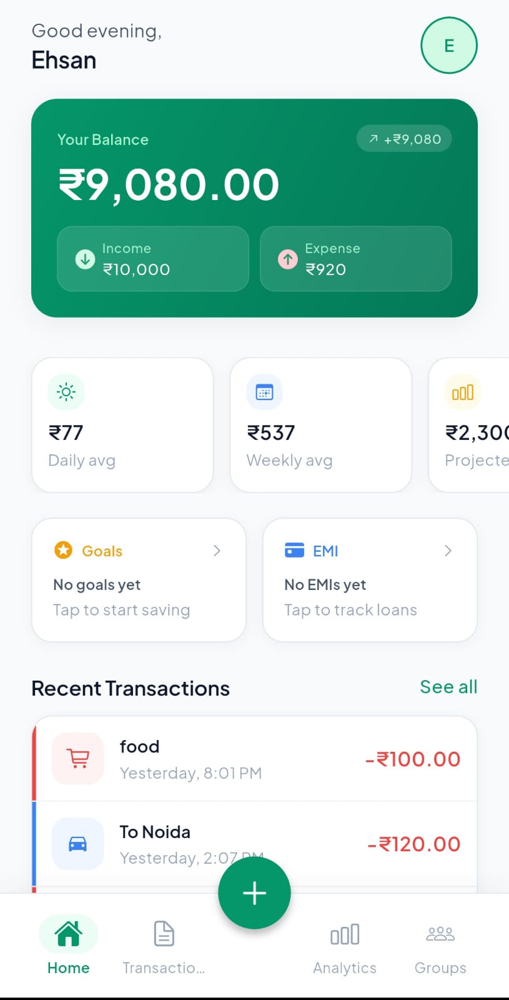
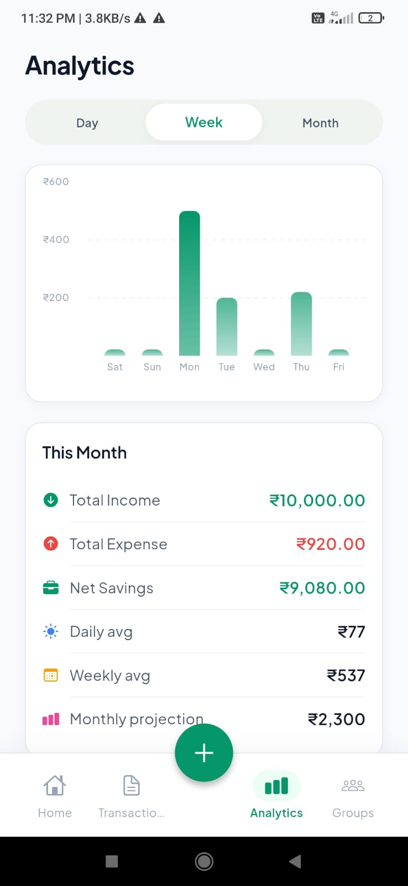
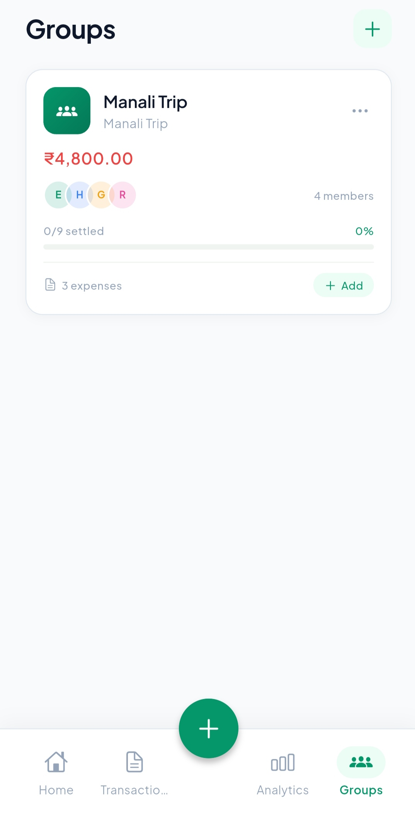
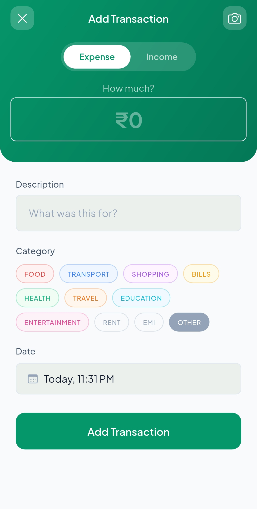
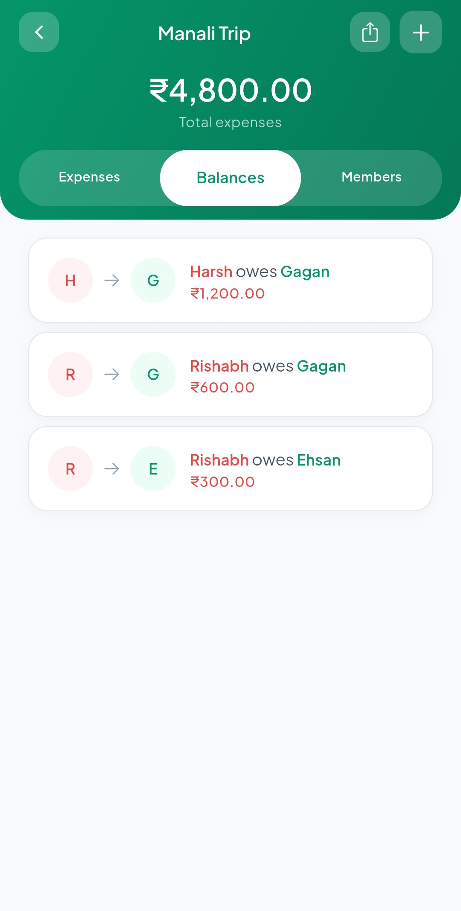
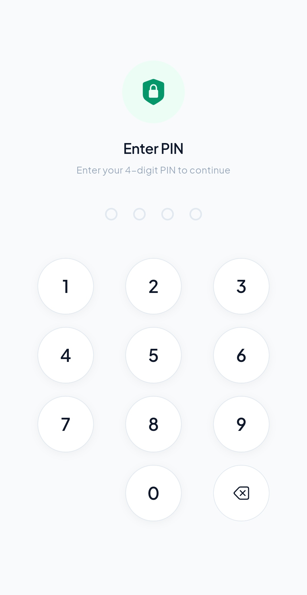

# MoneyBuddy — Personal Finance Manager

MoneyBuddy is a full-featured personal finance application built with Flutter. It covers the complete spectrum of personal money management — from daily expense tracking and receipt scanning to group expense splitting, savings goals, EMI monitoring, and spending analytics. The application is built for a single authenticated user with Firebase as the backend, following MVVM architecture with GetX for state management.

---

## Table of Contents

- [Overview](#overview)
- [Screenshots](#screenshots)
- [Features](#features)
- [Tech Stack](#tech-stack)
- [Architecture](#architecture)
- [Project Structure](#project-structure)
- [Key Implementation Details](#key-implementation-details)
- [Screens](#screens)

- [Demo Video](#demo-video)
- [Getting Started](#getting-started)
- [Developer](#developer)

---

## Overview

MoneyBuddy was built as a portfolio project to demonstrate production-level Flutter development. The goal was to build an app that a real user would actually use — not a tutorial clone. Every screen, feature, and edge case was designed with that in mind.

The app supports:
- Single user authentication via Firebase Auth
- Real-time data sync with Firestore
- Offline-first behavior using Firestore persistence
- Secure PIN-based app lock
- On-device ML for receipt scanning
- Local push notifications for budget and EMI alerts

---

 ---

## Screenshots

<table>
  <tr>
    <td align="center"><b>Home</b></td>
    <td align="center"><b>Analytics</b></td>
    <td align="center"><b>Groups</b></td>
  </tr>
  <tr>
    <td></td>
    <td></td>
    <td></td>
  </tr>
  <tr>
    <td align="center"><b>Add Transaction</b></td>
    <td align="center"><b>Balances</b></td>
    <td align="center"><b>PIN Lock</b></td>
  </tr>
  <tr>
    <td></td>
    <td></td>
    <td></td>
  </tr>
</table>

---

## Features

### Authentication
- Email and password registration and login
- Password reset via email
- Persistent session — user stays logged in across app restarts
- Onboarding screen for first-time users

### Home Dashboard
- Greeting with time-based message
- Balance card showing total income, expense, and remaining balance
- Today's spend card with daily budget comparison
- Horizontal scrollable stat cards — daily average, weekly average, projected monthly spend
- Budget progress bar with tap-to-navigate
- Goals and EMI mini cards showing nearest deadline goal and next due EMI
- Recent transactions list with category icons and slide-to-edit/delete

### Transaction Management
- Add income and expense transactions
- Category selection from predefined list — Food, Transport, Shopping, Bills, Health, Travel, Education, Entertainment, Rent, EMI, Salary, Freelance, Investment, and more
- Date and time picker
- Built-in expression calculator — enter "200+150" and it evaluates to 350
- Receipt scanner — take a photo or pick from gallery, ML Kit extracts amount and description automatically
- Edit and delete with swipe gestures
- Filter by type (All / Income / Expense)
- Search by description or category
- Date range filter
- Grouped by date — Today, Yesterday, and date labels

### Analytics
- Three tabs — Day (line chart), Week (bar chart), Month (bar chart)
- Y-axis with compact currency labels (₹500, ₹1k, ₹2k)
- X-axis with proper labels — 12A, 6A, 12P, 6P for day; Mon-Sun for week; W1-W4 for month
- Gradient bars with highlighted maximum bar
- Category breakdown with pie chart and progress bars
- Smart insights — week-over-week comparison, top spending category, month projection
- Spending forecast with confidence rating based on days of data

### Group Expenses
- Create groups with named members — no email required for friends
- Add expenses with who paid and split-between selection
- Automatic equal split calculation with per-person preview
- Debt minimization algorithm — computes minimum transactions to settle all balances
- Expenses tab — full split details with Paid/Pending badges per person
- Balances tab — shows exactly who owes whom and how much
- Members tab — list of all group members with creator badge
- Edit and delete expenses
- Share group summary via WhatsApp or any share target
- Mark settlements as paid

### Budget Management
- Set monthly budgets per spending category
- Visual progress bars per category
- Color-coded — green below 80%, amber above 80%, red over budget
- Tap from home screen to navigate directly to budget screen
- Triggers local notification when any category hits 80%

### Savings Goals
- Create goals with target amount, current saved amount, and deadline
- Circular progress indicator per goal
- Add money to a goal incrementally
- Days remaining countdown
- Mini card on home screen showing nearest deadline goal

### EMI Tracker
- Add loans with name, total amount, monthly EMI, start date, and tenure
- Tracks months paid and months remaining
- Mark current month as paid
- Color-coded due status — green, amber (due soon), red (overdue)
- Mini card on home screen showing next due EMI
- Triggers local notification 3 days before due date

### PIN Lock
- Set a 4-digit PIN stored in encrypted storage using Android Keystore
- PIN screen shown as the first screen on app start when PIN is set
- Shake animation on wrong PIN entry
- 3 wrong attempts triggers a 30-second cooldown timer
- Change PIN — verify old PIN then set new
- Remove PIN — verify current PIN then disable
- PIN is cleared on logout and account deletion

### Notifications
- Firebase Cloud Messaging for remote push support
- flutter_local_notifications for on-device alerts
- Budget alert — fires when any category reaches 80% of its budget
- EMI reminder — fires when an EMI is due within 3 days
- Weekly summary — spending report with budget comparison
- Notification channel with emerald green accent color
- Color-coded per notification type — amber for budget, blue for EMI, green for summary

### Profile
- Edit display name
- Update account balance
- Change password with current password verification
- Category Budgets, Savings Goals, EMI Tracker accessible from preferences
- Export transactions as CSV
- Security section — Set PIN, Change PIN, Remove PIN
- Logout with confirmation sheet
- Delete account with password confirmation and full data wipe

---

## Tech Stack

| Layer | Technology | Purpose |
|---|---|---|
| Framework | Flutter 3.x, Dart 3.x | Cross-platform UI |
| State Management | GetX | Reactive state, dependency injection, navigation |
| Backend Database | Firebase Firestore | Real-time NoSQL database with offline persistence |
| Authentication | Firebase Auth | Email/password auth with session persistence |
| Push Notifications | Firebase Cloud Messaging | Remote push notification delivery |
| Local Notifications | flutter_local_notifications 17.x | On-device notification scheduling and display |
| ML / OCR | Google ML Kit Text Recognition | On-device receipt text extraction |
| Image Picker | image_picker | Camera and gallery access for receipt scanning |
| Secure Storage | flutter_secure_storage | Encrypted PIN storage via Android Keystore |
| Local Storage | SharedPreferences | Non-sensitive preferences — budget limits, PIN enabled flag |
| Charts | fl_chart | Bar charts, line charts, pie charts |
| Animations | flutter_animate | Fade, slide, scale entrance animations |
| Date Picker | board_datetime_picker | Combined date and time selection |
| Sharing | share_plus | Export and share via system share sheet |
| Slidable | flutter_slidable | Swipe-to-edit and swipe-to-delete on transaction tiles |
| Math | math_expressions | Expression evaluation for calculator input |
| Fonts | google_fonts | Plus Jakarta Sans typography |

---

## Architecture

MoneyBuddy follows MVVM (Model-View-ViewModel) with a feature-first folder structure.

```
View        →  Screens and widgets (StatelessWidget / StatefulWidget)
ViewModel   →  GetX controllers (extends GetxController)
Model       →  Data models and Firestore service classes
```

**State Management**
GetX observables (`.obs`) drive all UI updates. Every piece of state that changes the UI is wrapped in a reactive variable and wrapped in `Obx()` in the widget tree. No `setState` is used anywhere.

**Navigation**
All routes are named and registered in `AppPages`. Navigation uses `Get.toNamed()`, `Get.offAllNamed()`, and `Get.back()`. The navigation stack is managed explicitly — for example, after group creation the stack is cleared to main before pushing the group detail screen.

**Dependency Injection**
Controllers are registered lazily via `GetX bindings`. Each feature has its own binding class. The main shell binding registers all tab controllers at once. Controllers are disposed automatically when their routes are removed from the stack.

**Firestore Data Structure**
```
users/{uid}/
  transactions/{txId}
  goals/{goalId}
  emis/{emiId}

groups/{groupId}/
  expenses/{expenseId}
```

Groups are stored at the top level (not under users) because the current user is always the creator and the `createdBy` field is used to filter.

---

## Project Structure

```
lib/
├── core/
│   ├── constants/
│   │   ├── app_colors.dart        # Design tokens — colors, gradients
│   │   └── app_strings.dart       # All string constants
│   ├── routes/
│   │   ├── app_routes.dart        # Named route constants
│   │   └── app_pages.dart         # GetPage registrations with bindings
│   ├── storage/
│   │   └── secure_storage.dart    # flutter_secure_storage wrapper
│   ├── theme/
│   │   ├── app_text_styles.dart   # Typography scale
│   │   ├── app_spacing.dart       # Spacing constants
│   │   ├── app_radius.dart        # Border radius constants
│   │   ├── app_shadows.dart       # Box shadow definitions
│   │   └── app_theme.dart         # ThemeData configuration
│   └── utils/
│       ├── formatters.dart        # Currency, date, number formatters
│       └── responsive.dart        # Screen-relative sizing utilities
│
├── features/
│   ├── auth/
│   │   ├── bindings/
│   │   ├── screens/               # Splash, onboarding, login, register,
│   │   │                          # forgot, confirm, PIN lock, PIN setup
│   │   └── services/
│   │       ├── auth_service.dart
│   │       └── pin_service.dart   # PIN CRUD with flutter_secure_storage
│   │
│   ├── home/
│   │   ├── controllers/home_controller.dart
│   │   ├── models/home_stats_model.dart
│   │   ├── screens/home_screen.dart
│   │   └── services/home_service.dart
│   │
│   ├── transactions/
│   │   ├── controllers/transaction_controller.dart
│   │   ├── models/transaction_model.dart
│   │   ├── screens/
│   │   │   ├── transaction_screen.dart
│   │   │   └── add_transaction_screen.dart
│   │   └── services/transaction_service.dart
│   │
│   ├── analytics/
│   │   ├── controllers/analytics_controller.dart
│   │   ├── models/
│   │   │   ├── graph_model.dart
│   │   │   └── prediction_model.dart
│   │   ├── screens/analytics_screen.dart
│   │   └── services/analytics_service.dart
│   │
│   ├── groups/
│   │   ├── controllers/group_controller.dart
│   │   ├── models/group_model.dart
│   │   ├── screens/
│   │   │   ├── group_screen.dart
│   │   │   ├── group_detail_screen.dart
│   │   │   ├── add_group_screen.dart
│   │   │   └── add_group_transaction_screen.dart
│   │   └── services/group_service.dart
│   │
│   ├── budget/
│   │   ├── controllers/budget_controller.dart
│   │   ├── screens/budget_screen.dart
│   │   └── budget_service.dart
│   │
│   ├── goals/
│   │   ├── controllers/goals_controller.dart
│   │   ├── models/goal_model.dart
│   │   ├── screens/goals_screen.dart
│   │   └── services/goals_service.dart
│   │
│   ├── emi/
│   │   ├── controllers/emi_controller.dart
│   │   ├── models/emi_model.dart
│   │   ├── screens/emi_screen.dart
│   │   └── services/emi_service.dart
│   │
│   ├── notifications/
│   │   └── notification_service.dart
│   │
│   ├── receipt_scanner/
│   │   └── receipt_scanner_service.dart
│   │
│   ├── profile/
│   │   ├── controllers/profile_controller.dart
│   │   ├── screens/
│   │   │   ├── profile_screen.dart
│   │   │   └── add_balance_screen.dart
│   │   └── services/profile_service.dart
│   │
│   └── main_shell/
│       ├── bindings/main_binding.dart
│       ├── controllers/main_controller.dart
│       └── screens/main_screen.dart
│
└── shared/
    └── widgets/
        ├── buttons/
        ├── cards/
        ├── feedback/
        ├── inputs/
        └── misc/
```

---

## Key Implementation Details

### Debt Minimization Algorithm
Group balances use a two-pass greedy algorithm. In the first pass, net balances are computed for each member across all expenses — crediting payers and debiting those who owe. In the second pass, creditors and debtors are sorted by amount and matched greedily to produce the minimum number of transactions required to settle all debts. This mirrors how Splitwise computes balances.

### Receipt Scanner
ML Kit Text Recognition runs entirely on-device — no API key, no network call. The raw OCR output is parsed using regex patterns to extract currency amounts (₹, Rs., Total, Grand Total) and a description from the first meaningful non-numeric line. The parser prefers larger amounts to identify the total rather than individual line items.

### PIN Security
The PIN is stored using flutter_secure_storage which maps to Android Keystore on Android and Keychain on iOS. The enabled flag is stored separately in SharedPreferences so the lock state can be checked synchronously at startup before Firebase initializes. On correct PIN entry the app navigates to the splash screen which then runs the normal auth check.

### Offline Support
Firestore persistence is enabled with unlimited cache size. All reads fall back to the local cache when offline. Writes are queued and synced when connectivity returns. The app is fully usable without internet for read operations.

### Name-Based Group Members
Groups store members by name only — friends do not need to have an account. The logged-in user is stored with their email as the first member. Payer identification in expense splitting uses name matching with `.trim().toLowerCase()` normalization to handle whitespace inconsistencies from Firestore data entry. Settlements store both name and email for dual-path matching.

### Expression Calculator
The amount field in add transaction accepts mathematical expressions. The `math_expressions` package evaluates the expression on every keystroke and shows the result below the input. On submit, the resolved value is used rather than the raw string.

### Responsive Sizing
All dimensions use a custom `R` utility class that scales sizes relative to screen width and height against a 390x844 baseline (iPhone 14). This ensures consistent proportions across different screen sizes without media queries in every widget.

---

## Screens

| Screen | Description |
|---|---|
| Splash | Auth state check and route decision |
| Onboarding | First-time user introduction |
| Login / Register | Firebase Auth with validation |
| PIN Lock | 4-digit secure entry with cooldown |
| PIN Setup | Set, change, or remove PIN |
| Home | Dashboard with balance, stats, quick cards |
| Transactions | Filterable, searchable transaction list |
| Add Transaction | Form with receipt scanner and calculator |
| Analytics | Charts, category breakdown, smart insights |
| Groups | Group list with settled percentage |
| Group Detail | Expenses, Balances, Members tabs |
| Add Group Expense | Amount, payer, split-between selector |
| Budget | Category budget progress cards |
| Goals | Savings goals with progress and add money |
| EMI Tracker | Loan EMI list with due status |
| Profile | Settings, security, preferences |

## Demo Video

---

## Getting Started

**Prerequisites**
- Flutter 3.x
- Dart 3.x
- Android SDK with NDK 27.0.12077973
- Firebase project with Auth and Firestore enabled
- google-services.json placed in android/app/

**Installation**

```bash
# Clone the repository
git clone https://github.com/originehsan/moneybuddy.git
cd moneybuddy

# Install dependencies
flutter pub get

# Generate Firebase options
flutterfire configure

# Run in debug mode
flutter run

# Build release APK
flutter build apk --release
```

**Firebase Setup**
1. Create a Firebase project at console.firebase.google.com
2. Enable Email/Password authentication
3. Create a Firestore database in production mode
4. Download google-services.json and place in android/app/
5. Run flutterfire configure to generate firebase_options.dart

---

## Developer

**Ehsan Ali**
Final Year B.Tech Computer Science
AKGEC Ghaziabad, Uttar Pradesh

GitHub: [github.com/originehsan](https://github.com/originehsan)

---

## License

This project is developed for portfolio and educational purposes.